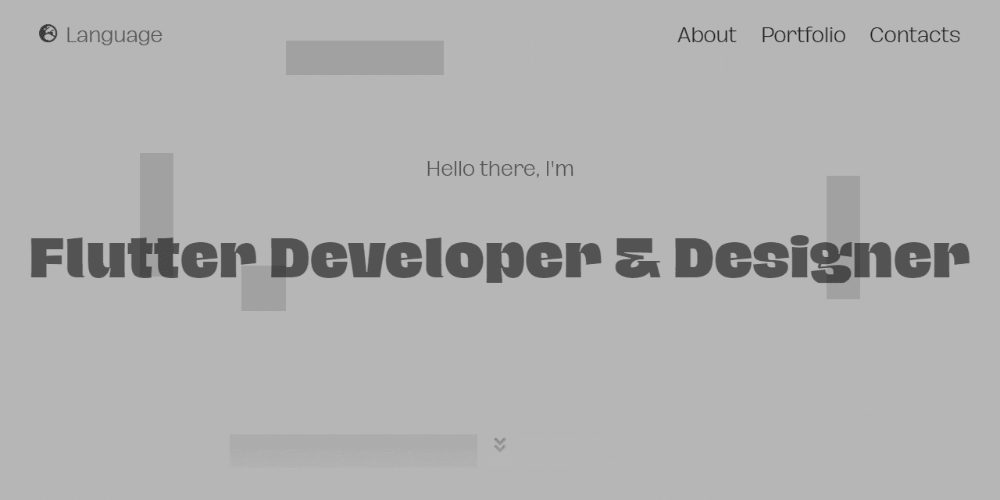

# tsin.is

**Welcome to the source code repository of my personal website available at [tsin.is](https://tsin.is)**

## About

You will definitely not find here fancy architecture and state managment (since there is no global states at all), or advanced navigations, there is no business and therefore no business logic. It's a simple, one-page static website made in Flutter. Perhaps you will like animations or design solutions — then you are in the right place. Thank you for the visit!

> **Note:**  At the moment, the website has clear scrolling problems in non-Chromium browsers (e.g. Mozilla Firefox) and on mobile Safari. The Google team is working on fixing these issues, please have patience.

## Licenses and Attributions

This project is released under the terms of the [GNU Affero General Public License v3.0](./LICENSE).

The font family used in the application is ["Hagrid Family"](https://www.zetafonts.com/collection/3760) by [Zetafonts](https://www.zetafonts.com) is licensed under [Creative Commons - Attribution - Non Commercial (CC BY-NC) License](./third-party/fonts/Hagrid/Hagrid-Family-CC-BY-NCLicensepdf.pdf).

## Credits

The above mentioned font family supports many languages that were translated and added to, with [Flutter Intl](https://marketplace.visualstudio.com/items?itemName=localizely.flutter-intl), and the package is responsible for their adaptive displaying is called [AutoSizeText](https://pub.dev/packages/auto_size_text). The interactive animation of my avatar is made in [Rive](https://flare.rive.app/a/), the Portfolio section uses the [Expandable](https://pub.dev/packages/expandable) package, and the package that is responsible for showing Google Maps in the Contacts is simply the [Map](https://pub.dev/packages/map), which is showing as a [Cached Network Image](https://pub.dev/packages/cached_network_image). All Dart code is linted with [Pedantic](https://pub.dev/packages/pedantic). In-app icons are generated with the help of [FlutterIcon.com](https://www.fluttericon.com). Framework itself and other dependencies are made by the excellent [Flutter](https://flutter.dev) Team.
